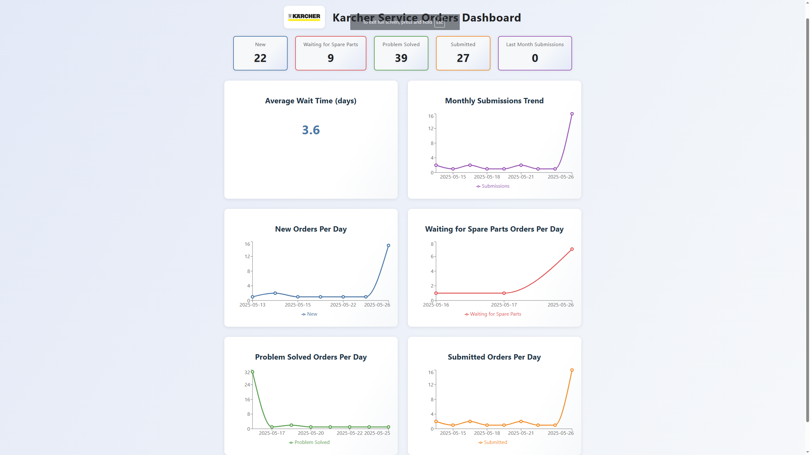

# Karcher Service Orders Dashboard

## Overview
This project is a modern Vite + React dashboard for Karcher Service Division that visualizes service order data. It provides real-time monitoring of service orders with different statuses, visualizes trends, and calculates key metrics.



## Features

- **Live Status Tracking**: Monitor New, Waiting for Spare Parts, Problem Solved, and Submitted orders
- **Dynamic Visualizations**: Interactive line charts showing daily orders for each status
- **Key Metrics**: Calculate average wait times and view last month's submission counts
- **Real-Time Updates**: Live data simulation (currently using mock data)
- **Karcher Branding**: Consistent with Karcher visual identity

## Technical Details

### Service Order Codes
- **Code 100**: New
- **Code 151**: Waiting for Spare Parts  
- **Code 500**: Problem Solved
- **Code 600**: Submitted

### Getting Started

1. Install dependencies:
   ```powershell
   npm install
   ```

2. Start the development server:
   ```powershell
   npm run dev
   ```

3. Build for production:
   ```powershell
   npm run build
   ```

## Project Structure
- `src/App.jsx` — Main dashboard component
- `src/App.css` — Styling for the dashboard
- `src/mockData.js` — Simulated service order data

## Future Integration

This dashboard is currently using mock data but is designed to integrate with the Karcher OneView API. The eventual goal is to:

1. Replace mock data with live API data from OneView
2. Implement authentication and user permissions
3. Add additional visualizations as requested by department heads
4. Develop filtering and search capabilities for service orders

## Customization
- The dashboard can be extended with additional metrics and visualizations
- Color scheme and styling can be adjusted to match corporate guidelines
- Data refresh rates can be configured based on server load considerations

---

This project was developed as a proof-of-concept to demonstrate the value of real-time service order visualization for the Karcher IT team.
